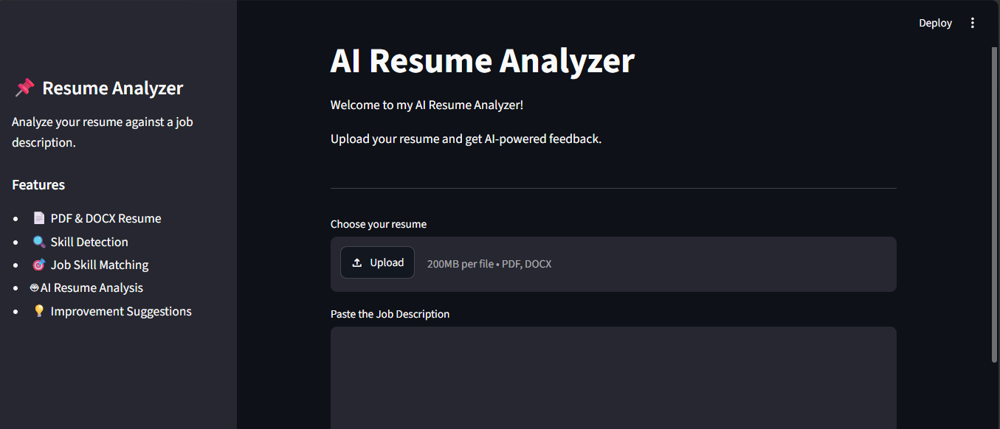
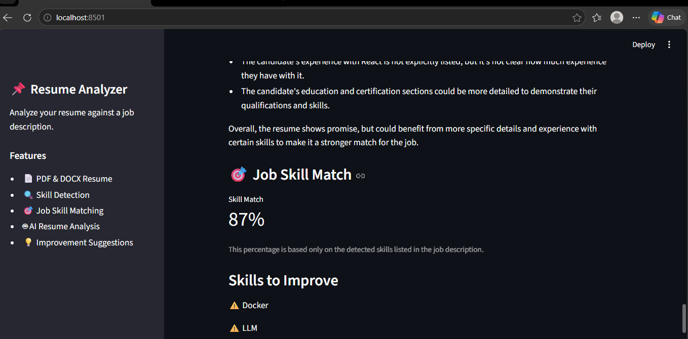

# AI Resume Analyzer

An AI-powered resume analysis application that compares a resume with a job description and provides skill-matching results and AI-generated improvement suggestions.

## Features

* 📄 Upload PDF and DOCX resumes
* 🔍 Extract resume text
* 🧠 Detect technical skills from resumes
* 📋 Detect required skills from job descriptions
* 🎯 Compare resume skills with job requirements
* 📊 Calculate a skill-match percentage
* ⚠️ Identify missing skills
* 🤖 Generate AI-powered resume analysis
* 💡 Provide practical resume improvement suggestions
* 🔒 Uses a locally running LLM through Ollama

## Technologies Used

* Python
* Streamlit
* PyMuPDF
* python-docx
* Regular Expressions (Regex)
* Ollama
* Llama 3.2
* Git & GitHub

## Project Highlights

- Built a web-based resume analyzer using Python and Streamlit.
- Supports both PDF and DOCX resume uploads.
- Extracts and analyzes technical skills using Python and Regex.
- Compares resume skills with skills required in a job description.
- Calculates a transparent skill-match percentage based on detected skills.
- Identifies missing skills that may need improvement.
- Integrated Llama 3.2 through Ollama for local AI-powered resume analysis.
- Designed to work without paid AI APIs.
## How It Works

1. Upload a PDF or DOCX resume.
2. The application extracts the resume text.
3. Enter the target job description.
4. The application identifies relevant technical skills.
5. Resume skills are compared with the required job skills.
6. The application calculates the detected skill-match percentage.
7. Missing skills are displayed.
8. Ollama and Llama 3.2 generate additional resume analysis and suggestions.

## Screenshots

### Application Interface



### Resume Analysis



## Local AI

This project uses **Ollama** to run the Llama 3.2 model locally.

No paid AI API is required for the AI analysis.

Before running the application, install Ollama and download the model:

```bash
ollama pull llama3.2:3b
```

Make sure Ollama is running before using the AI analysis feature.

## Installation

Clone the repository:

```bash
git clone YOUR_GITHUB_REPOSITORY_URL
```

Move into the project folder:

```bash
cd AI_Resume_Analyzer
```

Create and activate a virtual environment:

```bash
python -m venv venv
```

Activate it on Windows:

```bash
venv\Scripts\activate
```

Install the required Python packages:

```bash
pip install -r requirements.txt
```

Run the application:

```bash
streamlit run app.py
```

The application will open in your browser.

## Project Structure

```text
AI_Resume_Analyzer/
│
├── app.py
├── test_ai.py
├── requirements.txt
├── README.md
├── .gitignore
└── venv/
```

> `venv/` is used locally and should not be uploaded to GitHub.

## Future Improvements

* Improve skill and technology recognition
* Support additional resume formats
* Add more detailed resume scoring
* Improve AI-generated recommendations
* Add more job-role-specific skill analysis
* Improve the user interface

## Author

**Bhavya Pittala**

B.Tech – Electronics and Communication Engineering
